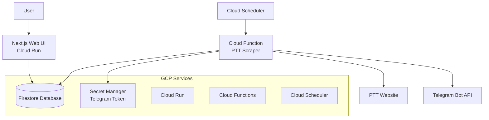

# Design Document

## Overview

The Automated PTT Telegram Scheduler extends the existing ptt-article-finder project to create a comprehensive system that automatically fetches PTT articles and delivers them via Telegram bot. The system consists of a Next.js web application for configuration management, Cloud Functions for article scraping, and various GCP services for orchestration and data persistence.

The architecture leverages the existing PTT scraping logic from the current LINE bot implementation while adapting it for Telegram delivery and adding scheduling capabilities.

## Architecture

### High-Level Architecture



### Service Architecture

1. **Next.js Application (Cloud Run)**
   - Frontend: React-based configuration interface
   - Backend: API routes for CRUD operations on configurations
   - Authentication: Simple session-based auth for configuration management

2. **Cloud Functions**
   - PTT Scraper Function: Executes article fetching and Telegram delivery
   - Triggered by Cloud Scheduler at configured intervals

3. **Data Layer**
   - Firestore: Stores user configurations and execution history
   - Secret Manager: Securely stores Telegram Bot tokens

4. **External Integrations**
   - PTT Website: Source of articles (using existing cloudscraper approach)
   - Telegram Bot API: Message delivery endpoint

## Components and Interfaces

### 1. Next.js Web Application

#### Frontend Components
- **ConfigurationForm**: Main form for setting up scraping jobs
- **ConfigurationList**: Display and manage existing configurations
- **Dashboard**: Show execution status and history
- **TaskHistory**: Detailed view of past executions

#### API Routes
- `POST /api/configurations` - Create new scraping configuration
- `GET /api/configurations` - List all configurations
- `PUT /api/configurations/[id]` - Update existing configuration
- `DELETE /api/configurations/[id]` - Delete configuration
- `GET /api/executions/[configId]` - Get execution history for a configuration

#### Configuration Schema
```typescript
interface ScrapingConfiguration {
  id: string;
  name: string;
  pttBoard: string;
  keywords: string[];
  postCount: number; // 1-100
  schedule: {
    type: 'hourly' | 'daily' | 'custom';
    interval?: number; // for custom intervals in minutes
    time?: string; // for daily schedules (HH:MM format)
  };
  telegramChatId: string;
  isActive: boolean;
  createdAt: Date;
  updatedAt: Date;
  lastExecuted?: Date;
  lastExecutionStatus?: 'success' | 'error' | 'no_articles';
  lastExecutionMessage?: string;
}
```

### 2. Cloud Function - PTT Scraper

#### Function Structure
```python
def main(request):
    """Main Cloud Function entry point triggered by Cloud Scheduler"""
    # 1. Query Firestore for active configurations
    # 2. For each configuration, execute scraping job
    # 3. Update execution status in Firestore
    
def execute_scraping_job(config):
    """Execute a single scraping job"""
    # 1. Fetch articles from PTT using existing scraper logic
    # 2. Filter articles by keywords
    # 3. Format articles for Telegram
    # 4. Send to Telegram Bot API
    # 5. Log results
```

#### PTT Scraper Integration
- Reuse existing `search_ptt_posts` method from current implementation
- Adapt cloudscraper configuration for Cloud Functions environment
- Implement retry logic for PTT access failures

#### Telegram Integration
```python
class TelegramBot:
    def __init__(self, token):
        self.token = token
        self.base_url = f"https://api.telegram.org/bot{token}"
    
    def send_message(self, chat_id, text, parse_mode='HTML'):
        """Send formatted message to Telegram chat"""
        
    def send_article_batch(self, chat_id, articles, board_name):
        """Send multiple articles as formatted messages"""
```

### 3. Database Schema (Firestore)

#### Collections

**configurations**
```json
{
  "id": "auto-generated",
  "name": "Tech Job Alerts",
  "pttBoard": "Tech_Job",
  "keywords": ["python", "backend", "工程師"],
  "postCount": 20,
  "schedule": {
    "type": "daily",
    "time": "09:00"
  },
  "telegramChatId": "123456789",
  "isActive": true,
  "createdAt": "2024-01-01T00:00:00Z",
  "updatedAt": "2024-01-01T00:00:00Z"
}
```

**executions**
```json
{
  "id": "auto-generated",
  "configurationId": "config-id",
  "executedAt": "2024-01-01T09:00:00Z",
  "status": "success",
  "articlesFound": 5,
  "articlesSent": 5,
  "errorMessage": null,
  "executionDuration": 2.5
}
```

### 4. Cloud Scheduler Configuration

#### Job Configuration
- **Job Name**: `ptt-telegram-scheduler`
- **Frequency**: Every 15 minutes (to check for due configurations)
- **Target**: Cloud Function HTTP trigger
- **Payload**: Empty (function queries database for due jobs)

## Data Models

### Configuration Management
```typescript
// Next.js API models
export interface CreateConfigurationRequest {
  name: string;
  pttBoard: string;
  keywords: string[];
  postCount: number;
  schedule: ScheduleConfig;
  telegramChatId: string;
}

export interface ScheduleConfig {
  type: 'hourly' | 'daily' | 'custom';
  interval?: number;
  time?: string;
}
```

### Article Processing
```python
# Python models for Cloud Function
@dataclass
class PTTArticle:
    title: str
    author: str
    date: str
    link: str
    board: str

@dataclass
class ExecutionResult:
    config_id: str
    status: str
    articles_found: int
    articles_sent: int
    error_message: Optional[str]
    execution_time: float
```

## Error Handling

### 1. PTT Access Errors
- **18+ Age Verification**: Implement automatic confirmation using existing logic
- **Rate Limiting**: Implement exponential backoff with jitter
- **Board Not Found**: Log error and mark configuration as failed
- **Network Timeouts**: Retry up to 3 times with increasing delays

### 2. Telegram API Errors
- **Invalid Chat ID**: Mark configuration as failed and notify via logs
- **Rate Limiting**: Implement message queuing with delays
- **Token Expiration**: Log error and halt execution
- **Message Too Long**: Split long messages or truncate with link

### 3. Database Errors
- **Firestore Unavailable**: Retry operations with exponential backoff
- **Configuration Not Found**: Skip execution and log warning
- **Write Failures**: Log error but continue with other configurations

### 4. Cloud Function Errors
- **Timeout**: Set function timeout to 9 minutes (max for HTTP functions)
- **Memory Limits**: Monitor memory usage and optimize if needed
- **Cold Starts**: Accept cold start delays for cost optimization

## Testing Strategy

### 1. Unit Testing

#### Next.js Application
- **API Routes**: Test CRUD operations with mock Firestore
- **Components**: Test form validation and user interactions
- **Utilities**: Test date/time parsing and validation logic

#### Cloud Function
- **PTT Scraper**: Test with mock PTT responses
- **Telegram Integration**: Test with mock Telegram API
- **Configuration Processing**: Test schedule evaluation logic

### 2. Integration Testing

#### End-to-End Flows
- **Configuration Creation**: Create config → verify in database → trigger execution
- **Article Fetching**: Mock PTT response → verify Telegram message sent
- **Error Scenarios**: Test PTT unavailable, Telegram API errors

#### Database Integration
- **Firestore Operations**: Test all CRUD operations
- **Transaction Handling**: Test concurrent configuration updates

### 3. Performance Testing

#### Load Testing
- **Multiple Configurations**: Test with 50+ active configurations
- **Concurrent Executions**: Verify Cloud Function scaling
- **Database Performance**: Test query performance with large datasets

#### Monitoring
- **Cloud Function Metrics**: Monitor execution time, memory usage, error rates
- **Firestore Metrics**: Monitor read/write operations and costs
- **Telegram API Limits**: Monitor rate limiting and message delivery

### 4. Security Testing

#### Authentication
- **API Access**: Test unauthorized access to configuration APIs
- **Input Validation**: Test malicious input handling

#### Secret Management
- **Token Access**: Verify Secret Manager integration
- **Environment Variables**: Ensure no secrets in code or logs

## Deployment Architecture

### 1. Cloud Run Configuration
```yaml
# cloud-run.yaml
apiVersion: serving.knative.dev/v1
kind: Service
metadata:
  name: ptt-telegram-scheduler
spec:
  template:
    metadata:
      annotations:
        autoscaling.knative.dev/minScale: "0"
        autoscaling.knative.dev/maxScale: "10"
    spec:
      containers:
      - image: gcr.io/PROJECT_ID/ptt-telegram-scheduler
        ports:
        - containerPort: 3000
        env:
        - name: GOOGLE_CLOUD_PROJECT
          value: PROJECT_ID
        resources:
          limits:
            cpu: "1"
            memory: "512Mi"
```

### 2. Cloud Function Configuration
```yaml
# function.yaml
runtime: python39
entry_point: main
timeout: 540s
memory: 256MB
environment_variables:
  GOOGLE_CLOUD_PROJECT: PROJECT_ID
```

### 3. IAM Permissions
- **Cloud Run Service Account**: 
  - Firestore read/write access
  - Cloud Logging write access
- **Cloud Function Service Account**:
  - Firestore read/write access
  - Secret Manager read access
  - Cloud Logging write access

### 4. Firestore Security Rules
```javascript
rules_version = '2';
service cloud.firestore {
  match /databases/{database}/documents {
    match /configurations/{document} {
      allow read, write: if request.auth != null;
    }
    match /executions/{document} {
      allow read, write: if request.auth != null;
    }
  }
}
```